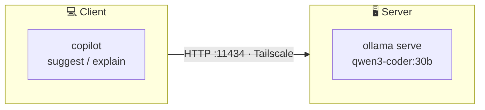

# BYOM: Bring Your Own Model

Run local AI with Ollama and GitHub Copilot CLI

---
layout: two-cols
ratio: "1:1"
title: Local LLM to cut costs
subtitle: When triaging SolutionQA takes all of your request budget
---

Agentic tools can consume a lot of API requests that burn through your budget quickly.

Copilot [recently announced](https://github.blog/changelog/2026-04-07-copilot-cli-now-supports-byok-and-local-models/) support for custom models.

**BYOM lets you swap in your own model**, running locally on a machine you control.

<div v-click="1">
<Highlight type="success">✓</Highlight> No premium request limits
</div>
<div v-click="2">
<Highlight type="success">✓</Highlight> No data leaving your network
</div>
<div v-click="3">
<Highlight type="success">✓</Highlight> Full control over the model (temperature, etc.)
</div>
<div v-click="4">
<Highlight type="danger">✗</Highlight> Requires a machine with a capable GPU
</div>
<div v-click="5">
<Highlight type="danger">✗</Highlight> Smaller models might not be good enough
</div>

::right::

<div v-click="6">



<br>
<div style="display:grid;grid-template-columns:auto 1fr;gap:2px 12px;align-items:center">
  <strong><a href="#server-setup">🖥️ Server</a></strong><span>GPU machine running Ollama</span>
  <strong><a href="#client-setup">💻 Client</a></strong><span>Any machine running <code>copilot</code> CLI</span>
</div>

</div>

<div v-click="7">

> [Tailscale](https://tailscale.com) simplifies remote access between machines.*

<p style="font-size:0.7em;opacity:0.6;margin-top:0.25em">* Any network that lets the client reach the server's IP works — LAN, WireGuard, <code>ngrok</code>, port forwarding, etc.</p>

</div>

---
layout: auto-size
title: Server Setup
subtitle: Install and expose Ollama on the Ubuntu server
---

::anchor{#server-setup}

<div v-click="1">

**Install Ollama**

```bash
curl -fsSL https://ollama.com/install.sh | sh
```

</div>

<div v-click="2">

**Bind to all interfaces**

```bash
sudo mkdir -p /etc/systemd/system/ollama.service.d
printf '[Service]\nEnvironment="OLLAMA_HOST=0.0.0.0:11434"\n' \
  | sudo tee /etc/systemd/system/ollama.service.d/override.conf
sudo systemctl daemon-reload && sudo systemctl restart ollama
```

</div>

<div v-click="3">

**Pull a model**

```bash
ollama pull qwen3-coder:30b
```

> Smaller models might not work as it cannot use the tools properly.

</div>

<div v-click="4" style="position:absolute;inset:0;display:flex;align-items:center;justify-content:center;background:var(--slidev-theme-background, #1a1a1a)">
  
</div>

---
layout: auto-size
title: Client Setup
subtitle: Connect GitHub Copilot CLI to the remote Ollama server
---

::anchor{#client-setup}

<div v-click="1">

**Install GitHub Copilot CLI**

```bash
curl -fsSL https://gh.io/copilot-install | bash
```

</div>

<div v-click="2">

**Check available models on the Ollama server**

```bash
curl http://SERVER_IP:11434/api/tags | jq
```

</div>

<div v-click="3">

**Prime the model** — run once on the server to keep it loaded

```bash
curl http://SERVER_IP:11434/api/generate \
  -d '{"model": "qwen3-coder:30b", "keep_alive": -1}' | jq
```

</div>

<div v-click="4">

**Use it**

```bash
COPILOT_PROVIDER_BASE_URL=http://SERVER_IP:11434/v1 \
  copilot --model qwen3-coder:30b
```

</div>

<!-- Replace client-setup.gif with your agg-rendered asciinema GIF -->
<div v-click="5" style="position:absolute;inset:0;display:flex;align-items:center;justify-content:center;background:var(--slidev-theme-background, #1a1a1a)">
  
</div>

---
layout: default
title: Model Output Comparison
subtitle: SolutionQA triage prompt — same input, different models
density: compact
---

SolutionsQA run: `solutionsqa`
<br>
Agent file from Guillaume's previous talk.

<div style="display:grid;grid-template-columns:1fr 1fr;gap:12px">

<div>
<p class="col-label">Claude Opus 4.6</p>
<div class="scroll-pane">

# Sample Output

</div>
</div>

<div>
<p class="col-label">qwen3-coder:30b</p>
<div class="scroll-pane">

# Sample Output

</div>
</div>

</div>

<style scoped>
.col-label {
  font-weight: 600;
  margin-bottom: 4px !important;
  font-size: 0.8em !important;
  line-height: 1.2 !important;
}
.scroll-pane {
  height: 220px;
  overflow-y: scroll;
  overscroll-behavior: contain;
  font-size: 0.68em;
  background: #e5e5e5;
  border-radius: 6px;
  padding: 10px;
  font-family: monospace;
  line-height: 1.4;
  border: 1px solid #333;
}
/* Neutralise scholarly theme's p/li upscaling inside the panes */
.scroll-pane :deep(p),
.scroll-pane :deep(li) {
  font-size: 1em !important;
  line-height: 1.4 !important;
  margin-bottom: 0.35em !important;
}
.scroll-pane :deep(pre) {
  margin: 0.35em 0 !important;
  padding: 0.4em !important;
  font-size: 0.95em !important;
}
.scroll-pane::-webkit-scrollbar { width: 4px }
.scroll-pane::-webkit-scrollbar-track { background: transparent }
.scroll-pane::-webkit-scrollbar-thumb { background: #444; border-radius: 4px }
</style>

---
layout: center
---

## Thank You

[Ollama Documentation](https://docs.ollama.com)

[Ollama Model Library](https://ollama.com/library)

[GitHub Copilot CLI — BYOK Models](https://docs.github.com/en/copilot/how-tos/copilot-cli/customize-copilot/use-byok-models)
