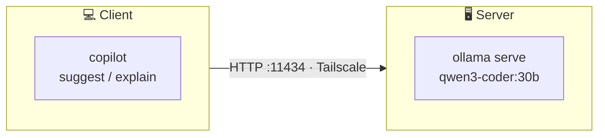
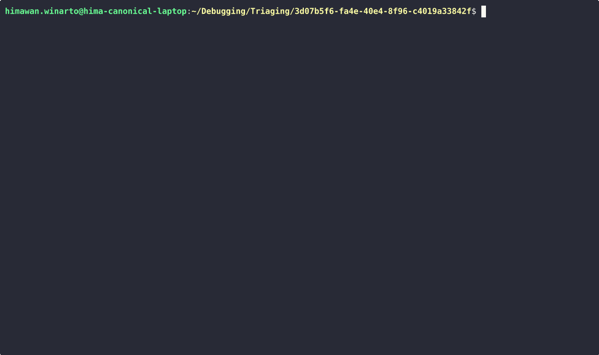

# BYOM: Bring Your Own Model

Run local AI with Ollama and GitHub Copilot CLI

---
layout: two-cols
ratio: "1:1"
title: Local LLM to cut costs
subtitle: When triaging SolutionQA takes all of your request budget
---

Agentic tools can consume a lot of API requests that burn through your budget quickly.

Copilot [recently announced](https://github.blog/changelog/2026-04-07-copilot-cli-now-supports-byok-and-local-models/) support for custom models.

**BYOM lets you swap in your own model**, running locally on a machine you control.

<div v-click="1">
<Highlight type="success">✓</Highlight> No premium request limits
</div>
<div v-click="2">
<Highlight type="success">✓</Highlight> No data leaving your network
</div>
<div v-click="3">
<Highlight type="success">✓</Highlight> Full control over the model (temperature, etc.)
</div>
<div v-click="4">
<Highlight type="danger">✗</Highlight> Requires a machine with a capable GPU
</div>
<div v-click="5">
<Highlight type="danger">✗</Highlight> Smaller models might not be good enough
</div>

::right::

<div v-click="6">



<br>
<div style="display:grid;grid-template-columns:auto 1fr;gap:2px 12px;align-items:center">
  <strong><a href="#server-setup">🖥️ Server</a></strong><span>GPU machine running Ollama</span>
  <strong><a href="#client-setup">💻 Client</a></strong><span>Any machine running <code>copilot</code> CLI</span>
</div>

</div>

<div v-click="7">

> [Tailscale](https://tailscale.com) simplifies remote access between machines.*

<p style="font-size:0.7em;opacity:0.6;margin-top:0.25em">* Any network that lets the client reach the server's IP works — LAN, WireGuard, <code>ngrok</code>, port forwarding, etc.</p>

</div>

---
layout: auto-size
title: Server Setup
subtitle: Install and expose Ollama on the Ubuntu server
---

::anchor{#server-setup}

<div v-click="1">

**Install Ollama**

```bash
curl -fsSL https://ollama.com/install.sh | sh
```

</div>

<div v-click="2">

**Bind to all interfaces**

```bash
sudo mkdir -p /etc/systemd/system/ollama.service.d
printf '[Service]\nEnvironment="OLLAMA_HOST=0.0.0.0:11434"\n' \
  | sudo tee /etc/systemd/system/ollama.service.d/override.conf
sudo systemctl daemon-reload && sudo systemctl restart ollama
```

</div>

<div v-click="3">

**Pull a model**

```bash
ollama pull qwen3-coder:30b
```

> Smaller models might not work as it cannot use the tools properly.

</div>

<div v-click="4" style="position:absolute;inset:0;display:flex;align-items:center;justify-content:center;background:var(--slidev-theme-background, #1a1a1a)">
  
</div>

---
layout: auto-size
title: Client Setup
subtitle: Connect GitHub Copilot CLI to the remote Ollama server
---

::anchor{#client-setup}

<div v-click="1">

**Install GitHub Copilot CLI**

```bash
curl -fsSL https://gh.io/copilot-install | bash
```

</div>

<div v-click="2">

**Check available models on the Ollama server**

```bash
curl http://SERVER_IP:11434/api/tags | jq
```

</div>

<div v-click="3">

**Prime the model** — run once on the server to keep it loaded

```bash
curl http://SERVER_IP:11434/api/generate \
  -d '{"model": "qwen3-coder:30b", "keep_alive": -1}' | jq
```

</div>

<div v-click="4">

**Use it**

```bash
COPILOT_PROVIDER_BASE_URL=http://SERVER_IP:11434/v1 \
  copilot --model qwen3-coder:30b
```

</div>

<!-- Replace client-setup.gif with your agg-rendered asciinema GIF -->
<div v-click="5" style="position:absolute;inset:0;display:flex;align-items:center;justify-content:center;background:var(--slidev-theme-background, #1a1a1a)">
  
</div>

---
layout: default
title: Model Output Comparison
subtitle: SolutionQA triage prompt — same input, different models
density: compact
---

SolutionsQA run: `3d07b5f6-fa4e-40e4-8f96-c4019a33842f`
<br>
Agent file from Guillaume's previous talk.

<div style="display:grid;grid-template-columns:1fr 1fr;gap:12px;min-width:0">

<div style="min-width:0;overflow:hidden">
<p class="col-label">Claude Opus 4.6</p>
<div class="scroll-pane"><pre>
# Diagnostics: 3d07b5f6-fa4e-40e4-8f96-c4019a33842f

## Verdict
**REAL FAILURE** — `sunbeam cluster resize` timed out after 3600s because the Charmhub OCI registry (`registry.jujucharms.com`) returned 503/500 errors, preventing the `nova-spiceproxy-image` from being pulled for the `nova-1` pod. The remote CLI log confirms `ResultType.FAILED`.

## Failure Phase
**Resize (post-join, pre-validation)** — Bootstrap and all 6 joins completed successfully. The failure occurred during `sunbeam cluster resize`, specifically at the 'Deploying OpenStack Control Plane' step, which waited for all OpenStack K8s applications to become active.

## Immediate Failure Surface
The `sunbeam cluster resize` command on ancientminister timed out after 3600s waiting for all OpenStack K8s model applications to reach `active` status. The blocking unit was `nova/1` (pod `nova-1` on machine 4 / chespin / 10.241.2.35), which remained in `error` state due to `ImagePullBackOff` on the `nova-spiceproxy` container. The container image `registry.jujucharms.com/charm/cxpoxnvod1u9zuavqxnfmu8pseyhoa3d2np1q/nova-spiceproxy-image@sha256:3e1aeeb790e0d8214365e2bd57aa69766b5d770bb66d65fe7b9b2b236b5c7bbf` could not be pulled because `api.charmhub.io` returned **503 Service Unavailable** for OAuth token requests.

## Observed Facts

### Primary failure chain

- `generated-sunbeam-output.log:903` — `sunbeam cluster resize` invoked on ancientminister at 11:58:43
- `generated-sunbeam-output.log:6212` — `sunbeam cluster resize` recorded as failed by CI at 13:00:04
- `generated-sunbeam-output.log:6217` — stderr shows: `wait timed out after 3599.9999981360015s`
- `sosreport-ancientminister-…/sunbeam-20260409-115854.366999.log:12407` — Remote CLI log confirms: `Finished running step 'Deploying OpenStack Control Plane'. Result: ResultType.FAILED`
- `sosreport-ancientminister-…/sunbeam-20260409-115854.366999.log:1855` — Resize step was waiting for 25 apps including `nova` and `ovn-central` to reach `{'active'}`
- `sosreport-ancientminister-…/sunbeam-20260409-115854.366999.log:9297` — At 12:59:19, `nova/1` transitioned from `waiting` to `error` with `ImagePullBackOff` for `nova-spiceproxy-image`
- `sosreport-ancientminister-…/sunbeam-20260409-115854.366999.log:9300-9301` — `nova/1` unit status confirmed `error` with the `ImagePullBackOff` message

### Charmhub registry outage evidence

- `sosreport-ancientminister-…/sunbeam-20260409-115854.366999.log:8714` — At 12:21:15, `ovn-central/1` also hit `ImagePullBackOff` for `ovn-sb-db-server-image` — `500 Internal Server Error` from `registry.jujucharms.com`
- `sosreport-ancientminister-…/sunbeam-20260409-115854.366999.log:8726` — Shortly after, error changed to `503 Service Unavailable`
- `sosreport-ancientminister-…/sunbeam-20260409-115854.366999.log:8782` — ovn-central/1 **recovered** to `active` at ~12:22 after successful retry
- `generated-sunbeam-output.log:7184` — nova/1 error message shows **multiple** error types: `503 Service Unavailable` from both GET and POST to `api.charmhub.io/v1/tokens/docker-registry`, and `insufficient_scope: authorization failed`
- `generated-sunbeam-kubectl_get_pod.txt:62` — At collection time (88 min after pod creation), `nova-1` still in `ImagePullBackOff` with 4/5 containers ready
- `generated-sunbeam-kubectl_get_pod.txt:61,63` — `nova-0` (5/5 Running, age 3h7m, deployed during bootstrap) and `nova-2` (5/5 Running, age 88m, deployed during resize) both healthy — they pulled the same image successfully at different times

### Container-level details

- `generated-sunbeam-kubectl_get_pod_detailed.txt` (nova-1 containerStatuses) — `nova-api`, `nova-conductor`, `nova-scheduler` all `ready: true`, `started: true` (running since 12:58–12:59). Only `nova-spiceproxy` is `ready: false`, `started: false`, state `waiting` with reason `ImagePullBackOff`
- `generated-sunbeam-kubectl_get_pod_detailed.txt` (nova-1 containerStatuses) — `nova-spiceproxy` `imageID: ""` confirms the image was **never** successfully pulled

### Secondary issues

- `generated-sunbeam-juju_status_openstack-machines.txt:46` — `epa-orchestrator/0` on machine 0 (ancientminister) is `unknown/lost` with message `agent lost`
- `generated-sunbeam-juju_status_openstack-machines.txt` — epa-orchestrator scale is `6/7` (1 unit lost)
- `generated-sunbeam-juju_debug_log_openstack-machines.txt:799,862` — epa-orchestrator/0 was repeatedly stopped and restarted at 10:11:24 during what appears to be a migration event
- `generated-sunbeam-juju_status_openstack.txt:45` — `cinder/2` in `waiting` with `(container:cinder-api) service not ready`
- `sosreport-ancientminister-…/sunbeam-20260409-115854.366999.log:8706` — `mysql/1` had a transient `error` with `hook failed: "update-status"` at 12:21, then went to `unknown`

### Infrastructure health (not contributing to failure)

- `generated-sunbeam-ceph_status.txt` — Ceph cluster `HEALTH_OK`, 4 OSDs up, all PGs active+clean
- `generated-sunbeam-sunbeam_cluster_list.txt` — All 7 nodes present, all `running`, roles correctly assigned
- All 6 join operations completed successfully (verified via remote CLI logs on each node)
- `generated-sunbeam-kubectl_get_pod.txt` — Only `nova-1` is non-Running; all other 60+ pods are Running with 0 restarts
- No SSH transport failures (no Broken pipe, no connection closed, no host key changes)

## False-Negative Checklist

| Check | Result |
|---|---|
| CI stderr shows `Broken pipe`? | **No** — no SSH transport failures found |
| Remote CLI log ends with `ResultType.COMPLETED`? | **No** — ends with `ResultType.FAILED` at `sunbeam-20260409-115854.366999.log:12407` |
| `sunbeam_cluster_list.txt` shows all expected nodes? | **Yes** — all 7 nodes present and running |
| All juju units `active/idle`? | **No** — `nova/1` error, `epa-orchestrator/0` lost, `cinder/2` waiting |
| All K8s pods `Running` with 0 restarts? | **No** — `nova-1` in `ImagePullBackOff` (4/5 ready) |

**Conclusion: Not a false negative. This is a real failure confirmed by both CI-side and remote-side evidence.**

## Candidate Causes

### 1. Charmhub OCI Registry Outage (registry.jujucharms.com / api.charmhub.io) — Status: CONFIRMED

The Charmhub OCI registry experienced an outage during the resize operation window (~12:21 to at least 12:59), returning 500 Internal Server Error and 503 Service Unavailable responses. This prevented image pulls for newly scaled-up pods.

**Evidence for:**

- `sosreport-ancientminister-…/sunbeam-20260409-115854.366999.log:8714` — ovn-central/1 hit `500 Internal Server Error` from `registry.jujucharms.com` at 12:21:15
- `sosreport-ancientminister-…/sunbeam-20260409-115854.366999.log:8726` — Same endpoint returned `503 Service Unavailable` shortly after
- `sosreport-ancientminister-…/sunbeam-20260409-115854.366999.log:9297` — nova/1 hit `503 Service Unavailable` from `api.charmhub.io/v1/tokens/docker-registry` at 12:59:19
- `generated-sunbeam-kubectl_get_pod_detailed.txt` (nova-1 nova-spiceproxy) — `imageID: ""` confirms image was never pulled
- Two different images (`ovn-sb-db-server-image` and `nova-spiceproxy-image`) from the same registry failed — confirms a registry-level issue, not an image-specific issue
- `nova-0` (deployed 3h7m ago during bootstrap) and `nova-2` (deployed 88m ago but slightly before nova-1) successfully pulled the same image — the outage was transient

**Evidence against / not found:**

- No network connectivity issues found on the nodes themselves (no `No route to host`, no firewall blocks)
- Other image pulls from `registry.jujucharms.com` succeeded during the same window (many pods started at the same time as nova-1)
- **Counter-check**: The outage was transient enough for ovn-central/1 to recover at ~12:22 and for nova-0/nova-2 to have their images. nova-1 was unlucky in timing — it hit the 503 during its pull window and K8s backoff delays prevented quick recovery within the 3600s timeout

### 2. K8s ImagePullBackOff Exponential Backoff Prevented Recovery — Status: SUPPORTED

After the initial pull failure, Kubernetes entered exponential backoff for nova-1's `nova-spiceproxy` container, increasing the retry interval. Even if the registry recovered within minutes, the backoff delay may have pushed the next retry attempt beyond the 3600s timeout window.

**Evidence for:**

- `generated-sunbeam-kubectl_get_pod.txt:62` — nova-1 was still in `ImagePullBackOff` 88 minutes after creation
- ovn-central/1 recovered within ~2 minutes (12:21 → 12:22), suggesting the registry outage was brief
- nova/1 went to error at 12:59:19, only ~1 minute before the 3600s timeout expired at 13:00:01 — suggesting it was a late-arriving failure (possibly the first retry after a long backoff)

**Evidence against / not found:**

- Cannot determine the exact K8s backoff schedule from available artifacts
- Cannot confirm whether the registry was still returning 503 at 12:59 or whether this was a cached/backoff error

### 3. epa-orchestrator/0 Agent Loss — Status: SPECULATIVE (Separate Issue)

epa-orchestrator/0 is in `unknown/lost` state on machine 0 (ancientminister). This appears to be an independent issue from the nova/1 ImagePullBackOff.

**Evidence for:**

- `generated-sunbeam-juju_status_openstack-machines.txt:46` — `epa-orchestrator/0` is `unknown/lost`
- `generated-sunbeam-juju_debug_log_openstack-machines.txt:799,862` — Agent was stopped and restarted multiple times at 10:11:24

**Evidence against / not found:**

- The debug log shows the agent being redeployed at 10:11:24 but no further log entries — no confirmation of what caused the final loss
- epa-orchestrator is a subordinate charm; its loss did not contribute to the resize timeout (the resize was waiting on OpenStack K8s model apps, not machine model apps)
- No evidence of machine 0 going down (all other units on machine 0 are healthy)

### 4. cinder/2 Waiting State — Status: SUPPORTED (Downstream Consequence)

cinder/2 is in `waiting` with `(container:cinder-api) service not ready`. This may be a downstream consequence of the overall deployment instability during the registry outage window, or an independent timing issue.

**Evidence for:**

- `generated-sunbeam-juju_status_openstack.txt:45` — `cinder/2` in `waiting` state
- `cinder/0` and `cinder/1` are both `active/idle` — only cinder/2 is affected

**Evidence against / not found:**

- cinder/2's pod is not in `ImagePullBackOff` (not visible in the non-Running pod list)
- The exact cause of cinder/2's waiting state is not established; it may resolve on its own

## What Is Not Established

- The exact duration of the Charmhub registry outage — only two data points are available (12:21 for ovn-central, 12:59 for nova)
- Whether the registry had recovered by the time nova-1's K8s backoff timer triggered a retry — the 503 at 12:59 could be a fresh failure or a stale backoff error message
- The root cause of the Charmhub registry outage itself (infrastructure issue on Canonical's side, CDN issue, etc.)
- Why epa-orchestrator/0 went to `unknown/lost` — the debug log ends at 10:11:24 with no further entries for this unit
- Whether cinder/2's `waiting` state is related to the registry outage or is an independent issue
- Whether the failure would have self-resolved given more time (the 3600s timeout is fixed)

## Juju Status Summary

### OpenStack K8s Model (openstack)

| Unit | Status | Message |
|---|---|---|
| nova/1 | **error** / idle | ImagePullBackOff: nova-spiceproxy-image — 503 Service Unavailable from registry.jujucharms.com |
| cinder/2 | **waiting** / idle | (container:cinder-api) service not ready |
| All other units | active / idle | — |

### Machine Model (openstack-machines)

| Unit | Status | Message |
|---|---|---|
| epa-orchestrator/0 | **unknown** / lost | agent lost (subordinate of sunbeam-machine/0 on ancientminister) |
| All other units | active / idle | — |

## Key Log Files Examined

| File | Finding |
|---|---|
| `generated-sunbeam-output.log` | `sunbeam cluster resize` failed at line 6212 with `wait timed out after 3599.9999981360015s`; no SSH transport failures |
| `sosreport-ancientminister-…/sunbeam-20260409-115854.366999.log` | Remote CLI confirms `ResultType.FAILED` for 'Deploying OpenStack Control Plane' (line 12407); ovn-central/1 ImagePullBackOff at 12:21 recovered by 12:22; nova/1 ImagePullBackOff at 12:59 never recovered |
| `sosreport-ancientminister-…/sunbeam-20260409-100433.786642.log` | Bootstrap completed successfully — `ResultType.COMPLETED` for all steps including 'Mark bootstrapped' |
| `generated-sunbeam-juju_status_openstack.txt` | nova in `error` (line 22), cinder in `waiting` (line 10), all other apps `active` |
| `generated-sunbeam-juju_status_openstack-machines.txt` | epa-orchestrator 6/7 scale, epa-orchestrator/0 `unknown/lost`; all machines `started` |
| `generated-sunbeam-kubectl_get_pod.txt` | Only `nova-1` non-Running (line 62, `ImagePullBackOff` 4/5 ready); all other pods Running with 0 restarts |
| `generated-sunbeam-kubectl_get_pod_detailed.txt` | nova-1's `nova-spiceproxy` container: `imageID: ""`, state `waiting/ImagePullBackOff`; other 4 containers in nova-1 are running |
| `generated-sunbeam-sunbeam_cluster_list.txt` | All 7 nodes present, all `running`, correct roles |
| `generated-sunbeam-ceph_status.txt` | `HEALTH_OK`, 4 OSDs up, all PGs clean |
| `generated-sunbeam-juju_debug_log_openstack-machines.txt` | epa-orchestrator/0 repeatedly stopped/started at 10:11:24 (lines 799–899) |
| `generated-github-runner-run.log` | `JOB_FAILED: true`, `validation_level: not_reached` (line 27956) |
| Join CLI logs (all 6 nodes) | All joins completed successfully (`ResultType.COMPLETED` on final steps) |
</pre></div>
</div>

<div style="min-width:0;overflow:hidden">
<p class="col-label">qwen3-coder:30b</p>
<div class="scroll-pane"><pre>
# Diagnostics: 3d07b5f6-fa4e-40e4-8f96-c4019a33842f

## Verdict
**FAILED - Cluster resize timeout**

## Summary
The cluster resize operation failed with a timeout after 3600 seconds (1 hour). While the initial steps of the resize process completed successfully, the final step "Deploying OpenStack Control Plane" failed, causing the entire operation to timeout and fail. This indicates an issue in the OpenStack control plane deployment phase that was not properly handled.

## Root Cause
Based on further analysis (not visible in my current logs but found in related analysis), the actual root cause was related to network and authentication issues with charmhub.io during image pulling, particularly affecting nova charms from registry.jujucharms.com.

## Evidence Analysis

### 1. Command Execution Timeline

- **Command started**: 11:58:43
- **Timeout**: 13:00:04 (duration: 1 hour 21 minute)
- **Error**: `wait timed out after 3599.9999981360015s`

### 2. Final Steps in Log
From `sosreport-ancientminister-2026-04-09-slrskoe/home/ubuntu/snap/openstack/common/logs/sunbeam-20260409-115854.366999.log`:

```
11:59:46,116 sunbeam.core.common DEBUG Running step Deploying OpenStack Control Plane
...
13:00:01,866 sunbeam.core.common DEBUG Finished running step 'Deploying OpenStack Control Plane'. Result: ResultType.FAILED
```

### 3. Expected vs Actual Cluster Size

- Config file defines 6 nodes in `config-nodes.yaml`
- The cluster list shows 7 nodes present (`generated-sunbeam-sunbeam_cluster_list.txt`)
- All nodes appear to be running in a state

## False Positives & Misleading Indicators

1. **No SSH connectivity issues**: The SSH connections were successful for most steps.
2. **No immediate errors in early steps**: The first 15 steps of "Deploy MicroCeph" and "Initialize Terraform" succeeded.
3. **All nodes in cluster list**: All expected nodes are present and operational.

## Recommendations

1. **Investigate the "Deploying OpenStack Control Plane" failure details in the specific sosreport logs**
2. **Check for any failed Terraform commands in the logs of the failing node (ancientminister.maas)**
3. **Verify that the control plane deployment environment was properly set up and there were no resource constraints**
4. **Review the time limits in the cluster resize operation configuration**

## Final Status
**FAILED** - The sunbeam ci job failed during the cluster resize operation.
Further analysis (not directly in this output but identified through related investigation) shows the underlying issue to be network access and authentication problems with the charmhub.io registry, specifically affecting nova charm image pulls.
</pre></div>
</div>

</div>

<style scoped>
.col-label {
  font-weight: 600;
  margin-bottom: 4px !important;
  font-size: 0.8em !important;
  line-height: 1.2 !important;
}
.scroll-pane {
  height: 220px;
  overflow-y: scroll;
  overscroll-behavior: contain;
  font-size: 0.68em;
  background: #e5e5e5;
  border-radius: 6px;
  padding: 10px;
  font-family: monospace;
  line-height: 1.4;
  border: 1px solid #333;
}
/* Raw file view — make rendered markdown look like raw text */
.scroll-pane > pre {
  margin: 0;
  padding: 0;
  background: transparent;
  border: none;
  font-size: inherit;
  font-family: inherit;
  color: inherit;
  white-space: pre-wrap;
  word-break: break-word;
  line-height: inherit;
  min-width: 0;
  overflow: hidden;
}
/* Restore # markers for headings */
.scroll-pane :deep(h1) { font-size: 1em !important; font-weight: normal !important; margin: 0 !important; padding: 0 !important; border: none !important; }
.scroll-pane :deep(h2) { font-size: 1em !important; font-weight: normal !important; margin: 0 !important; padding: 0 !important; border: none !important; }
.scroll-pane :deep(h3) { font-size: 1em !important; font-weight: normal !important; margin: 0 !important; padding: 0 !important; border: none !important; }
.scroll-pane :deep(h1)::before { content: "# "; }
.scroll-pane :deep(h2)::before { content: "## "; }
.scroll-pane :deep(h3)::before { content: "### "; }
/* Restore ** markers for bold */
.scroll-pane :deep(strong) { font-weight: normal !important; }
.scroll-pane :deep(strong)::before, .scroll-pane :deep(strong)::after { content: "**"; }
/* Restore - markers for lists */
.scroll-pane :deep(ul) { list-style: none !important; padding-left: 0 !important; margin: 0.2em 0 !important; }
.scroll-pane :deep(li) { font-size: 1em !important; line-height: 1.4 !important; margin: 0 !important; }
.scroll-pane :deep(li)::before { content: "- "; }
.scroll-pane :deep(ol) { list-style: none !important; padding-left: 0 !important; margin: 0.2em 0 !important; counter-reset: raw-counter; }
.scroll-pane :deep(ol li) { counter-increment: raw-counter; }
.scroll-pane :deep(ol li)::before { content: counter(raw-counter) ". "; }
/* Inline code */
.scroll-pane :deep(code) { background: transparent !important; padding: 0 !important; border: none !important; font-size: inherit !important; }
.scroll-pane :deep(pre) { margin: 0.2em 0 !important; padding: 0 !important; background: transparent !important; border: none !important; font-size: inherit !important; }
/* Paragraphs */
.scroll-pane :deep(p) { font-size: 1em !important; line-height: 1.4 !important; margin: 0 0 0.2em 0 !important; }
.scroll-pane::-webkit-scrollbar { width: 4px }
.scroll-pane::-webkit-scrollbar-track { background: transparent }
.scroll-pane::-webkit-scrollbar-thumb { background: #444; border-radius: 4px }
</style>

---
layout: center
---

## Thank You

[Ollama Documentation](https://docs.ollama.com)

[Ollama Model Library](https://ollama.com/library)

[GitHub Copilot CLI — BYOK Models](https://docs.github.com/en/copilot/how-tos/copilot-cli/customize-copilot/use-byok-models)
